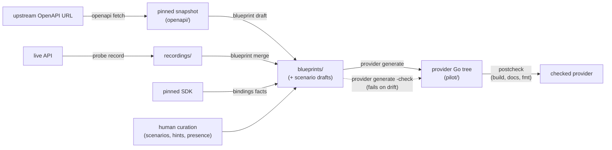

# terraform-plugin-framework-codegen

A toolkit that programmatically generates [terraform-plugin-framework][framework]
providers from an API specification **plus recorded API behaviour**, so that
state mapping is compile-checked generated code instead of runtime reflection —
and so that the first acceptance run confirms what the evidence already proved,
instead of discovering what it missed.

> **Status: the pilot is real.** The pipeline runs end to end and has been walked
> across five recorded batches: 23 resource blueprints, 22 resources green against
> the live API in CI, 20 committed recordings, plus data sources, an
> ephemeral and an action. The full cross-repo chain — OpenAPI document bump → SDK
> regeneration and release → provider re-generation → live acceptance — has been
> validated once, deliberately. See [Roadmap](#roadmap).

## Why

An OpenAPI document tells you what an API's fields are *called*. It does not
tell you the things that decide whether a Terraform provider actually works:

- which fields are genuinely writable, versus accepted and silently discarded
- which are immutable, and so need `RequiresReplace`
- what the server rewrites on the way in — case, whitespace, URL form, list
  order, timestamp format — every one of which is a perpetual diff
- what it defaults when you omit a field, and whether that default is a real
  constant or a derived value that must simply be `Computed`
- whether `PATCH` merges or replaces, whether create returns the object, and how
  long after create the thing is actually readable

A generator that trusts the OpenAPI document produces providers with perpetual
diffs, spurious replacements, and `provider produced inconsistent result after
apply`. The alternative, historically, is discovering each fact one production
bug at a time and encoding it as a hand-maintained special case.

So this toolkit **pokes the live API and records what it does**. The probe
transcripts are committed as recordings, facts are re-derived from them offline
in CI, and they feed the generator alongside the OpenAPI document.

The pilot taught one more lesson, big enough to reshape the pipeline: it is not
enough to probe fields one behaviour at a time and let acceptance tests find the
rest. Fixing failures after generation is whack-a-mole against the most expensive
oracle available. So the probe now ends by **rehearsing the exact lifecycles the
generated acceptance tests will run** — same values, same bodies, both directions
— before any provider code exists. Acceptance is confirmation, not discovery.

## Key features

- **A 16-probe catalogue** against a live sandbox: six read-only probes and
  ten mutating ones, ending with `write.rehearsal` — minimal→maximal and
  maximal→minimal lifecycles, per-hop echo comparison, in-bounds contrast values,
  and single-culprit bisection of refused bodies.
- **Recordings you can replay.** Every recorded run freezes its transcript, facts,
  scenario, subject and rehearsal bodies; CI re-derives the facts offline with
  egress blocked and fails on any difference.
- **Static facts from the SDK itself.** Behaviour written into the SDK's struct
  tags (a zero value the encoding cannot send) is derived by inspection, not
  probed, and drift-checked against the pinned SDK version.
- **One fixture derivation, two renderings.** The values the probe rehearses on
  the wire are the values the generator renders into `minimal.tf`/`maximal.tf` —
  format-aware (`date-time`, `uuid`, `ipv4`, …), with curated hints and omissions
  where no derivation can know.
- **Deterministic, committed artefacts with a drift check on every arrow** —
  snapshots, blueprints, scenarios, recordings, static facts, the generated tree,
  the exported Provider Code Specification (codegen-spec v0.1). Byte-identical
  regeneration is a tested property.
- **Generation finishes with the tools that check it.** `provider generate` runs
  a postcheck battery — compile, tfplugindocs, `terraform fmt` — so a tree that
  would fail CI fails at generation time.
- **A hard generated/hand-written boundary**, enforced five ways, with an escape
  hatch that scaffolds once and never regenerates.
- **Safety as structure, not convention**: mutating probes sit behind a
  runtime-verified sandbox guard, every create is ledgered before it is issued,
  cleanup is per-probe, and cassettes pass a refuse-on-detect secret scan before
  anything is written.

## High-level architecture



with drift checking: `provider generate -check`. Alongside the main line,
`bindings facts` derives static facts from the pinned SDK for `blueprint merge`
to fold in, human curation (scenarios, hints, presence) feeds the same merge,
and `provider generate` finishes with a postcheck battery (build · docs · fmt).

Each arrow writes a **committed, reviewable artefact**. CI regenerates every one
of them and fails on drift, then builds and tests the result — because a
generator change can produce a clean diff and broken code. The
[checks](docs/checks.md) page lists every job and its local reproduction.

A blueprint names SDK symbols as strings, so `tfpfgen bindings check` type-checks
them against the SDK the provider actually pins. That turns a wrong symbol from a
pile of identical compile errors in generated code into one message naming the
blueprint field to edit.

### Repository layout

| Path | Contents |
|---|---|
| `cmd/tfpfgen/` | the one installable binary; stdlib `flag` subcommand dispatch |
| `internal/blueprint/` | the IR, its validation, and the layered-merge engine |
| `internal/openapi/` | OpenAPI document → draft blueprints |
| `internal/snapshot/` | pinned OpenAPI snapshots: list, read, checksum, pin |
| `internal/spec/` | reads and writes `terraform-plugin-codegen-spec` v0.1 |
| `internal/probe/` | the API behaviour prober |
| `internal/cassette/` | HTTP record/replay, redaction, deterministic canonicalisation |
| `internal/fixturespec/` | the one derivation of fixture values, rendered as HCL and as wire JSON |
| `internal/generate/` | blueprint → Go: rendering, formatting, writing, postcheck |
| `internal/sdkbind/` | type-checks blueprint bindings against the pinned SDK; derives static facts |
| `internal/manifest/` | what the last run produced, so orphaned files can be found |
| `internal/templates/` | embedded `.tmpl` files — the generated shape, as reviewable text |
| `blueprints/` | committed blueprints, scenarios and static facts, one directory per provider |
| `recordings/` | committed probe recordings and derived facts |
| `openapi/` | pinned, immutable OpenAPI snapshots |
| `specs/` | the committed spec export, drift-checked |
| `pilot/thousandeyes/` | a nested module: a fully generated provider, built, unit-tested and live-tested in CI |
| `docs/` | architecture, guides and the CLI reference — see below |

## Quick start

The loop, end to end (each step's full story is in the
[onboarding runbook](docs/onboarding-a-new-api.md)):

```bash
tfpfgen openapi fetch -url https://…/api.yaml -out openapi/PROVIDER
tfpfgen blueprint draft -tag THING -out blueprints/PROVIDER -scenario-drafts blueprints/PROVIDER
tfpfgen bindings check -blueprint blueprints/PROVIDER -module pilot/PROVIDER
tfpfgen probe record -blueprint blueprints/PROVIDER -resource THING \
  -allow-mutations -profile .tfpfgen/sandbox/PROVIDER.json
tfpfgen blueprint merge -blueprint blueprints/PROVIDER -facts recordings/…/facts.json
tfpfgen provider generate -blueprint blueprints/PROVIDER -out pilot/PROVIDER
```

The safe verbs are the defaults: a bare `probe` means `probe replay`, which reads
the committed recording and never the network; mutating runs demand a sandbox
profile that proves itself at runtime, and the token comes from
`TFPFGEN_PROBE_TOKEN` — never a flag, never a file.

## What is generated and what is yours

The boundary is the most important thing to understand about a generated
provider. Generated files carry exactly this header, and nothing else may:

```go
// Code generated by tfpfgen from blueprints/<path>
// (sha256:…). DO NOT EDIT.
```

Broadly: CRUD, models, schemas, registration, acceptance tests and **both**
fixture files are generated; authentication, the client, plan modifiers and
read-back predicates are yours — scaffolded once where declared, then never
touched again. There is deliberately **no** preserved-region mechanism inside a
generated file: ownership is all-or-nothing per file.

[`docs/generated-boundary.md`](docs/generated-boundary.md) has the full ownership
table, the five enforcement mechanisms, and the escape hatch.

## Relationship to HashiCorp's code generation tooling

This toolkit is **not** a wrapper around `tfplugingen-openapi` or
`tfplugingen-framework`. Those generate a schema and a model struct and stop:
they generate no CRUD logic at all, and they cannot express `dynamic` attributes,
`int32`/`float32`, blocks, resource identity, or write-only attributes. Their
renderers live under `internal/`, so there is nothing to import.

What this project does adopt is the **Provider Code Specification** as an
interop format: `tfpfgen spec export` and `spec import` write and read v0.1
JSON, so `tfplugingen-openapi` output can be imported and the schema slice can
be handed to other tools. Everything that format cannot carry — CRUD wiring,
SDK binding, observed behaviour, test scaffolding — lives in this project's own
richer IR.
CI feeds the committed export to HashiCorp's real `tfplugingen-framework` on
every PR, as a conformance oracle that does not share this repository's
assumptions ([docs/interop.md](docs/interop.md)).

## Documentation

| Doc | What it covers |
|---|---|
| [docs/architecture.md](docs/architecture.md) | the pipeline, package map, and where logic may live |
| [docs/onboarding-a-new-api.md](docs/onboarding-a-new-api.md) | the end-to-end runbook, walked ~20 times |
| [docs/cli.md](docs/cli.md) | every subcommand, flag and exit code |
| [docs/blueprint.md](docs/blueprint.md) | the IR, field by field |
| [docs/probing.md](docs/probing.md) | the probe catalogue, sandbox guard, ledger, budgets |
| [docs/fixtures-and-rehearsal.md](docs/fixtures-and-rehearsal.md) | fixture derivation and the rehearsal fixpoint |
| [docs/generated-boundary.md](docs/generated-boundary.md) | what is generated, what is yours, how it is enforced |
| [docs/checks.md](docs/checks.md) | every CI check and its local reproduction |
| [docs/interop.md](docs/interop.md) | the codegen-spec v0.1 bridge |
| [docs/glossary.md](docs/glossary.md) | the glossary — every domain term, one meaning each |

## Roadmap

| Phase | Delivers | State |
|---|---|---|
| 0 | module, CLI skeleton, CI checks | **done** |
| 1 | walking skeleton: one resource, hand-authored blueprint → `terraform plan` | **done** |
| 1b | nested attributes | **done** |
| 2 | `blueprint draft`: OpenAPI → the same blueprint, byte-identical | **done** |
| 3 | `terraform-plugin-codegen-spec` v0.1 interop | **done** |
| 4 | the prober: record, replay, guarding, cleanup | **done** |
| 5 | block kinds: data sources, actions, identity, list resources, arbitrary-depth nesting, generated validators, read-after-write, escape hatches | **done** |
| 6 | breadth: 23 resources across five batches; probe resequencing (rehearsal, static facts, generated fixtures); postcheck; the OpenAPI refresh loop; SDK chain validated end to end | **done** |
| 7 | a second API, proving nothing is pilot-shaped | next |

Three pilot resources are deferred with their reasons recorded in the blueprints:
agent-to-agent, voice and endpoint scheduled tests all need lab hardware
(enterprise or endpoint agents) that a disposable tenant does not have. Read-only
results surfaces were never in scope. The dashboard `layout` attribute is dropped
pending a widgets model.

**Generated today:** resources, data sources, actions, ephemerals, resource
identity, list resources. Provider-defined functions, state upgrader *bodies*
(the scaffold exists) and `statestore` are not modelled at all; none appears in
the reference provider, which is why they are last rather than next.

## Limitations

- **Probing needs a sandbox tenant and consumes its quota.** Mutating probes
  refuse to run unless the profile asserts, at runtime, that it really is a
  sandbox — `sandbox: true` is a claim, and the assertions are the evidence.
  Read-only probing is safe anywhere.
- **A mutating run can still leave something behind, and says so.** The ledger
  records every create before it is issued, so an object whose response was never
  seen is still findable; the sweeper removes by identifier and then by name
  prefix. Anything left is reported with a runnable `curl` and exits 5 even if
  every fact was gathered. See [docs/probing.md](docs/probing.md).
- **A wrong fact is worse than no fact.** Inferred field interdependencies are recorded as
  documentation, never as active constraints.
- **A generated validator errs toward permitting.** `OneOf` comes from the value set the
  *OpenAPI document declares*, not from the narrower set one tenant was observed to accept:
  the documented set is the wider of the two, so a stale document surfaces as a real
  API error carrying the API's own message rather than as a `terraform plan` failure
  nobody can work around. Where the prober saw a documented value refused, it stays
  permitted and the refusal is named in a comment beside the validator.
- **The rehearsal bisects one culprit at a time.** A body refused because of two
  *interacting* fields exceeds the bisection budget and is recorded as a refusal
  note for a human, not silently guessed at.
- **The prober cannot learn everything.** Licence-dependent behaviour, cross-object
  constraints, RBAC, production latency, and whether a field is *semantically* a
  secret all need a human. The scenario's deny list and the blueprint's
  curated hints are where that boundary is drawn honestly.
- **`blueprint draft` refuses partial resources by default.** A resource whose CRUD
  set is incomplete is a curation decision, not something to guess at.
- **There is no numeric-integrality probe.** A field the OpenAPI document types as
  `number` is generated as `float64` even when every recorded observation of it
  is integral; the observations are suggestive, not a derived fact.

## Contributing

See [`CONTRIBUTING.md`](CONTRIBUTING.md). The one rule specific to this
repository: **generated artefacts are regenerated, never hand-edited.** Change
the blueprint, the templates, or the generator, and re-run. CI enforces this.

## License

[MIT](LICENSE).

[framework]: https://developer.hashicorp.com/terraform/plugin/framework
