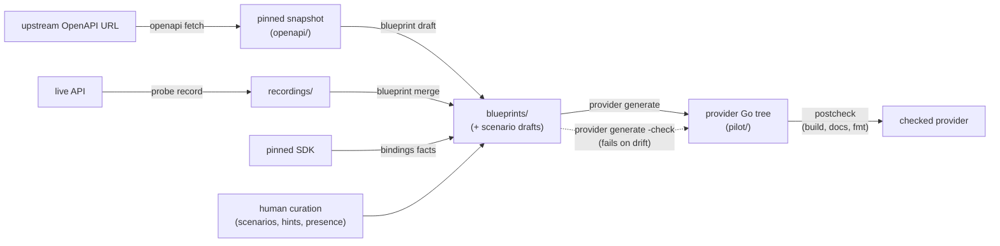

# Architecture

The toolkit turns a **blueprint** into a terraform-plugin-framework provider. This
describes the stages, and — more usefully — where logic is allowed to live and why
those boundaries are drawn where they are.

## The pipeline



with drift checking: `provider generate -check`. Alongside the main line,
`bindings facts` derives static facts from the pinned SDK for `blueprint merge`
to fold in, human curation (scenarios, hints, presence) feeds the same merge,
and `provider generate` finishes with a postcheck battery (build · docs · fmt).

Every arrow's output is a committed, reviewable artefact. That is deliberate: a
pipeline whose intermediate state lives only in memory can only be reviewed by
reading its output, and its output is thousands of lines of generated Go. And
every arrow has a drift check in CI — see [checks.md](checks.md).

Every stage is built, and each is a verb of the one binary.

| Stage | Package | State |
|---|---|---|
| `openapi fetch` — fetch and pin an OpenAPI snapshot | `internal/snapshot` | **built** — the refresh loop re-fetches from the latest snapshot's recorded source |
| `blueprint draft` — OpenAPI → blueprint + scenario drafts | `internal/openapi` | **built** |
| `probe` — live API → behaviour facts | `internal/probe` | **built** (record, replay, verify, sweep, list; the rehearsal fixpoint) |
| `blueprint merge` — fold facts into a blueprint | `internal/blueprint/merge` | **built** (plus scenario adoption) |
| `provider generate` — blueprint → provider, postchecked | `internal/generate`, `internal/templates` | **built** |
| `provider generate -check` — fail on drift | `cmd/tfpfgen/generate_check.go`, `internal/manifest` | **built** |
| `bindings` — type-check bindings against the SDK; derive static facts | `internal/sdkbind` | **built** |
| `spec` — Provider Code Specification v0.1 | `internal/spec` | **built** (export; import writes drafts) |

## Where logic is allowed to live

This is the load-bearing rule, and most of the structure follows from it.

**All logic lives in `internal/generate`.** Every value a template consumes is a
finished Go expression, a finished declaration, or a boolean. Templates branch on
*presence* — "is there a description?" — never on *meaning* — "what kind of
attribute is this?". Render, in this codebase, means template execution and
nothing more.

The reason is reviewability. `internal/templates` is the generated shape written
as ordinary text, so you can read what the generator produces without reading the
generator. A template containing type dispatch destroys that: the shape becomes
something you have to simulate mentally rather than read.

The convention is inherited from the sibling SDK generator, whose
`service.go.tmpl` consumes only precomputed strings.

If a template needs to decide something, the decision belongs in `generate`.

**Recursion is handled in Go, not in templates.** A Terraform schema is recursive,
and the obvious response — one recursive template — would put the shape back
inside logic. Instead `generate` walks the attribute tree and produces finished
declarations, which the file template merely lists.

## Package map

```
cmd/tfpfgen/           CLI. stdlib flag, one FlagSet per verb, no cobra.
internal/
  blueprint/           the IR: types, validation, canonical JSON, layered load
  generate/            ALL generation logic. Blueprint -> finished strings;
                       fileset build, format, write, postcheck. Owns gofumpt
                       and overwrite refusal.
  templates/           embedded .tmpl. The generated shape, as reviewable text.
  manifest/            what the last run produced, so orphans can be found
  naming/              identifiers. One word-splitter, several joins.
  sdkbind/             type-checks bindings against the SDK actually pinned
                       -- every kind that has one: resources, data sources,
                       list facets and actions. Also derives static facts
                       (zero-value unsendable) from the SDK's struct tags.
  fixturespec/         ONE derivation of acceptance-fixture values, rendered
                       as HCL by generate and as wire JSON by probe
  openapi/             OpenAPI document -> draft blueprints + scenario worksheets
  snapshot/            pinned OpenAPI snapshots: list, read, checksum, pin
  probe/               the probe catalogue, guard, ledger, sweeper, budgets
  cassette/            transcripts: record, redact, replay, freeze
  spec/                codegen-spec v0.1 export and import
  version/             the tool version, in exactly one place
```

`naming` and `blueprint` depend on nothing else in the repo. `generate` depends
on `blueprint`, `naming`, `fixturespec` and `templates`. Nothing depends on
`cmd`.

Two behaviours live in `cmd` rather than in a stage package, on purpose. The
rehearsal fixpoint (`rehearse.go`) alternates probing and merging until fixture
derivation converges, and scenario adoption (`promote.go`) copies scenario values
into blueprint hints — both need packages from opposite ends of the pipeline, and
the probe must never import the package that interprets its output. The command
layer is the only place allowed to see both at once.

## Determinism

Generated output must be byte-identical for identical inputs. The drift check
regenerates and fails on any diff, so a single unstable value would make CI fail
on runs that changed nothing — and a CI failure that everyone learns to ignore is
worse than no CI at all.

What that forbids, in generated files and in the manifest:

- no timestamps
- no tool version (it lives in `.tfpfgen/manifest.json`, and nowhere else,
  so a release is a one-line diff rather than a rewrite of the tree)
- no absolute paths
- no reliance on Go map iteration order; every map is rendered through a sorted
  key slice, and every IR slice is sorted by a declared key before rendering

`TestUnit_Generate_IsDeterministic` builds the pilot twenty-five times and
compares. Twenty-five rather than two, because map iteration order varies per
iteration and two runs can agree by luck.

## Formatting

Generated code is formatted with **gofumpt**, not `go/format`.

This is not a style preference. The target repositories run gofumpt, gci and
golines with autofix enabled. Output that is merely gofmt-clean gets silently
rewritten the first time a developer opens the file, and then shows up as drift
with no source change — which reads as a generator bug and is not one.

Import blocks are generated pre-grouped into the three sections the house `gci`
configuration expects: standard library, third party, then `deploymenttheory`.

Each generated file gets its **own** import set. A shared block would fail to
compile in most of them, since Go rejects unused imports.

## Failure behaviour

The generator fails loudly rather than producing something approximate.

- An attribute whose type has no framework mapping is a hard error, not a skipped
  attribute. Silently omitting one produces a provider that looks complete and
  cannot express part of the API.
- An unresolvable conversion is a hard error listing every unresolved pair, not
  just the first.
- Nesting deeper than the generator supports is refused, naming the offending
  attribute.
- A template that renders unparseable Go returns the numbered source with the
  error, because a formatter reports a line and column and matching that against
  unnumbered output is needless work.
- `provider generate` refuses to overwrite a file that is not marked generated.

## Further reading

- [`blueprint.md`](blueprint.md) — the IR, field by field
- [`generated-boundary.md`](generated-boundary.md) — what is generated, what is
  yours, and how the two are kept apart
- [`probing.md`](probing.md) — the probe catalogue, guard, ledger and budgets
- [`fixtures-and-rehearsal.md`](fixtures-and-rehearsal.md) — fixture derivation
  and the rehearsal fixpoint
- [`checks.md`](checks.md) — every CI check and its local reproduction
- [`cli.md`](cli.md) — command reference
