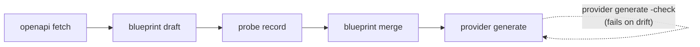

# CLI reference

`tfpfgen` is one binary with a noun-group grammar: the first word names the
artefact, the second what to do to it — `tfpfgen <command> <verb> [flags]`.
Dispatch is the standard library's `flag` package; each verb owns its own
`FlagSet`, so there is no global flag namespace for two verbs to collide in, and
`tfpfgen provider generate -q` reads naturally rather than requiring flags before
the command.

This page is asserted against the binary by a unit test: the usage lines and
flag tables below are checked against the registered flag sets, so a flag that
exists is listed and a flag that does not cannot appear here.

## Commands

Listed in pipeline order — the order an author walks them, which is also the
order `help` prints them.

| Command | Purpose | Verbs |
|---|---|---|
| `openapi` | fetch and pin upstream OpenAPI documents | `fetch` |
| `sdk` | generate a Go SDK from a pinned OpenAPI snapshot | `generate`, `push` |
| `blueprint` | draft, merge, validate, diff or list blueprints | `draft`, `merge`; `validate`, `diff`, `list` planned |
| `probe` | exercise a resource's lifecycle; record or replay cassettes | `record`, `replay`, `verify`, `sweep`, `list` |
| `provider` | derive the provider block, generate the provider tree and its shell | `init`, `generate`, `push`, `scaffold` |
| `bindings` | check blueprint SDK bindings against the pinned SDK | `check`, `facts` |
| `spec` | export or import Provider Code Specification v0.1 JSON | `export`, `import` |
| `version` | print the toolkit version and exit | — |

The pipeline, in the order an author walks it:



with drift checking: `provider generate -check`.

A planned verb is registered and documented but not implemented: running one
says so and exits non-zero. Registering the full surface up front means `help`
describes the intended pipeline from the first commit, and reaching for a
missing stage gets a straight answer rather than "unknown verb".

Two pieces of pipeline behaviour live *inside* verbs rather than as verbs of
their own, and it is worth saying so because the source layout suggests
otherwise: the **rehearsal fixpoint** (`cmd/tfpfgen/rehearse.go`) is a behaviour
of `probe record`, and **scenario adoption** (`cmd/tfpfgen/promote.go`) is a
behaviour of `blueprint merge -adopt-scenarios`. There is no `rehearse` or
`adopt` verb.

## Global flags

Accepted by every verb.

| Flag | Purpose |
|---|---|
| `-q` | suppress progress output |
| `-chdir <dir>` | change to this directory before running (`-C` for short) |

The bare binary also accepts `-version`, which is `tfpfgen version`.

## Exit codes

Scripts branch on these, so they are a contract rather than an implementation
detail.

| Code | Meaning |
|---|---|
| `0` | success |
| `1` | failure — including drift, and a mismatched binding |
| `2` | invalid input: a usage error, or an unusable scenario or profile |
| `3` | guard refused the run (`probe`) |
| `4` | budget exceeded (`probe`) |
| `5` | cleanup left orphaned objects (`probe`) |
| `6` | replay mismatch (`probe`) |
| `7` | redaction check failed (`probe`) |

A malformed flag exits `2`, not `1`: a caller mistake must not be reported the
same way as the tool failing.

Where several of `3`–`7` apply at once — a run can exceed its budget, sweep, and
still leave an orphan — the precedence is **7 > 5 > 3 > 4 > 6 > 1**. It is a
table rather than a walk over the error tree, because the first match in a tree
walk is not the most serious condition, and which code CI sees must not depend
on the order the errors happened to be joined in.

---

## `openapi`

### `openapi fetch`

Fetches the upstream OpenAPI document and pins it as a new snapshot.

```
tfpfgen openapi fetch [-url URL] -out DIR [-dry-run]
```

| Flag | Default | Purpose |
|---|---|---|
| `-url` | the latest snapshot's recorded source | the document to fetch |
| `-out` | — | snapshot root to pin into, e.g. `openapi/thousandeyes` (required) |
| `-dry-run` | `false` | fetch and report, but pin nothing |

The refresh loop is the point: with `-url` omitted, the source comes from the
latest snapshot's own metadata, so `openapi fetch -out openapi/thousandeyes`
re-fetches from wherever the last pin came from. No one has to remember the URL,
because the snapshot that would go stale is the thing that records it. `-url` is
only required for the very first snapshot.

A snapshot is a directory holding the document and its metadata (source URL,
digest, fetch time). Snapshots are immutable and checksum-verified on load. An
upstream document identical to the latest snapshot pins nothing and exits `0` —
the weekly refresh should be quiet when there is nothing to review. The fetch is
bounded at two minutes: a document is a couple of megabytes, and anything slower
is a network problem worth hearing about.

## `sdk`

### `sdk generate`

Generates a Go SDK from a pinned OpenAPI snapshot with [Microsoft
Kiota](https://github.com/microsoft/kiota), so a provider can bind to an SDK
that is itself derived from the same document the blueprints were drafted from.

```
tfpfgen sdk generate [-openapi-dir DIR] [-snapshot NAME] -out DIR [-mode embed|external] [-module PATH] [-client-name NAME] [-check] [-dry-run]
```

| Flag | Default | Purpose |
|---|---|---|
| `-openapi-dir` | `openapi/thousandeyes` | directory holding pinned OpenAPI snapshots |
| `-snapshot` | the newest | snapshot to read |
| `-out` | — | SDK root to write into (required) |
| `-mode` | `embed` | `embed` generates under the enclosing module; `external` emits a standalone tree with its own go.mod |
| `-module` | derived / — | Go import path of the SDK root; derived from the enclosing go.mod under `embed`, required under `external` |
| `-client-name` | `ApiClient` | root client type name |
| `-include` | — | restrict to these API path globs, e.g. `/tags/**`; comma-separate several |
| `-exclude` | — | drop these API path globs; comma-separate several |
| `-clean` | `false` | delete files a previous generation produced that this one does not |
| `-check` | `false` | write nothing and exit 1 if the committed SDK has drifted from the snapshot or the pinned kiota version |
| `-dry-run` | `false` | print the resolved snapshot and invocation, run nothing |

`kiota` is a PATH tool, like git and terraform — this command never downloads
it. Determinism comes from a refusal instead: kiota's own `kiota-lock.json`,
written into the output and committed, records the version that produced the
tree, and `sdk generate` refuses to run a different one, naming both. Output is
deterministic for a given (kiota version, snapshot, parameters) and is passed
through the same gofumpt form the provider generator uses.

Under `-mode embed` the SDK lands inside the provider's module (kiota's
intended layout: the import path is the module path plus the output
directory), so `bindings check`, the drift checks and `provider push` all see
one module. Under `-mode external` the tree gets a minimal generated `go.mod`
(then `go mod tidy` resolves the kiota runtime modules) and is ready for its
own repository. `-check` regenerates into scratch and byte-compares — the only
proof that the committed tree still follows from the pinned snapshot.

**Built-in normalisation.** Two corrections answer kiota's own behaviour
rather than any one document's mistakes, so generation always applies them
before any patch: every schema `default` is stripped (a kiota constructor
stamps defaults onto the models it builds, leaking fields the provider never
wired into every request body and masking absence on responses), and every
single-member anonymous `allOf` is collapsed into its parent (kiota synthesizes
names for anonymous schemas and dedupes structurally identical ones with an
unstable canonical winner). Both accept a document with nothing to correct.

**Document patches.** When a published document is provably wrong about the
live API (a probe recording shows the API accepting and echoing an enum value
the document omits), a *document patch* records the divergence:
`<openapi-dir>/patches/*.patch.json`, each holding a `justification` naming
the evidence and RFC 6902 `operations` scoped to it. Patches apply to a copy
(the snapshot's bytes and checksum never change; application preserves
document order, which kiota's inline-schema naming depends on), generation
reads the copy, and `-check` applies them identically, so a patch is part of
what the committed tree provably follows from. When the vendor fixes the
document, an `add` that finds its value already present refuses as *stale* —
the prompt to delete the patch. With no patches directory, the snapshot is
read directly.

### `sdk push`

Publishes an external-mode SDK tree to its own repository, as a branch and a
pull request — the SDK counterpart of `provider push`.

```
tfpfgen sdk push -out DIR -repo URL [-branch NAME] [-base NAME] [-dry-run]
```

| Flag | Default | Purpose |
|---|---|---|
| `-out` | — | SDK root to publish, as written by `sdk generate -mode external` (required) |
| `-repo` | — | target repository: a clone URL or GitHub `owner/name` (required) |
| `-branch` | `tfpfgen/sdk-<digest>` | branch to push; the digest is derived from `kiota-lock.json`, so the same generation always names the same branch |
| `-base` | the repository's default branch | branch to diff and open the pull request against |
| `-dry-run` | `false` | clone and compare, but push nothing and open nothing |

The token doctrine, sync, prune and pull-request behaviour are `provider
push`'s exactly, with the SDK's own provenance records in the provider's
places. Push refuses a tree without a `kiota-lock.json` (nothing this pipeline
generated) and a tree without a `go.mod` (an *embedded* SDK, whose import path
only works inside the provider module — only `-mode external` output can live
in its own repository). Because the SDK root itself carries no manifest — it
is byte-compared against fresh kiota output, and a foreign file would fail
that check — the inventory that makes pruning safe is written into the
*target* repository as `.tfpfgen/manifest.json` by each push and read by the
next, so the target's own files (its licence, its workflows) are never
touched. Commits and pull requests land on the generator-owned
`tfpfgen/sdk-*` branch namespace, naming the kiota version and the pinned
document's hash.

## `blueprint`

### `blueprint draft`

Infers draft blueprints (and optionally scenario worksheets) from a pinned
OpenAPI snapshot.

```
tfpfgen blueprint draft [-openapi-dir DIR] [-snapshot NAME] [-tag TAG] [-sdk-dialect restyService|kiotaFluent] [-exclusions FILE] [-out DIR] [-dry-run]
```

| Flag | Default | Purpose |
|---|---|---|
| `-openapi-dir` | `openapi/thousandeyes` | directory holding pinned OpenAPI snapshots |
| `-snapshot` | the newest | snapshot to read |
| `-openapi` | — | read this OpenAPI document directly, bypassing the snapshot store |
| `-tag` | — | restrict to candidates whose tag or key contains this; comma-separate several |
| `-dry-run` | `false` | list what the document offers and write nothing |
| `-include-unusable` | `false` | include candidates that cannot become resources or data sources |
| `-out` | — | write inferred blueprints under this directory (required unless `-dry-run`) |
| `-provider` | `thousandeyes` | provider name, which prefixes every resource type |
| `-sdk-service-root` | the ThousandEyes SDK's | import prefix the SDK's service packages live under |
| `-sdk-accessor` | `r.client.API` | expression reaching a service from the resource receiver |
| `-api-version-dir` | `v7` | version directory generated packages live under |
| `-scenario-drafts` | — | also scaffold a `KEY.scenario.draft.json` scenario worksheet per resource under this directory |
| `-sdk-dialect` | `restyService` | binding shape to infer: `restyService`, or `kiotaFluent` for a kiota-generated SDK |
| `-sdk-models-package` | — | import path of the kiota SDK's models package (required with `-sdk-dialect kiotaFluent`; the resty `-sdk-service-root`/`-sdk-accessor` knobs are refused under it) |
| `-exclusions` | `<openapi-dir>/draft-exclusions.json` | curated sidecar of families drafting must skip, each entry carrying its reason; the run repeats every exclusion as a named skip |
| `-prune-module` | | module root holding the pinned SDK; every drafted binding is resolved against the real SDK before writing -- spellings the SDK carries under another canonical name are repaired in place, and shapes it cannot carry are pruned, each as a named removal. Needs the provider block present in `-out` |

`blueprint draft -dry-run` is the survey: it reports every candidate the
document offers and why the ineligible ones are ineligible. The write path
produces **drafts** — a schema and a best-guess binding, which a human then
curates (presence, hints, denials, sweep configuration) before the file earns
its non-draft name. The `-scenario-drafts` worksheets serve the same role for
scenarios: every field listed with a place to put fixture values and candidates,
nothing invented. An existing draft is never overwritten; promoting one is a
rename, which is a diff a reviewer sees.

Under `-sdk-dialect kiotaFluent` the drafted bindings are fluent chains derived
from each operation's path template — `/tags/{tagId}` becomes
`Tags().ByTagId(id).Get(ctx, nil)` — with method access, model constructors and
kiota's own accessor spelling (plain word capitalisation plus keyword mangling,
so `accountGroupId` maps to `GetAccountGroupId`). The names are derived from
the OpenAPI document, not the generated SDK; `bindings check` resolves every
one against the real SDK and its did-you-mean answers with the true spelling.

### `blueprint merge`

Folds a probe run's facts into the blueprint they describe.

```
tfpfgen blueprint merge -blueprint DIR -facts FILE [-strategy annotate|apply] [-check] [-allow-conflicts] [-summary PATH]
```

| Flag | Default | Purpose |
|---|---|---|
| `-blueprint` | — | blueprint file or directory (required) |
| `-facts` | — | facts JSON to fold in (required) |
| `-strategy` | `annotate` | `annotate` writes behaviour and descriptions; `apply` may also widen presence |
| `-check` | `false` | write nothing and exit 1 if merging would change anything |
| `-allow-conflicts` | `false` | suppress the conflict exit code; conflicts are still reported and still not applied |
| `-recording` | the facts file's directory | identifies the recording in the description marker |
| `-adopt-scenarios` | — | directory of `KEY.scenario.json` scenario files whose fixture values are adopted into `accFixture` wire hints, for attributes the generator refuses to derive |
| `-summary` | `$GITHUB_STEP_SUMMARY` | append a markdown summary here |

`annotate` is the default because most of what a probe learns lands in
`behaviour` and in the description marker block, neither of which changes the
schema. `apply` is for the facts that do — a field observed as server-populated
widening to `computed_optional`, for instance — and a fact whose application
would *conflict* with a curated declaration is reported and left alone under
either strategy. `-allow-conflicts` suppresses the exit code only; it never
applies anything.

`-check` is the drift check: CI re-merges every committed facts file and fails
if any blueprint would change, so recordings and blueprints cannot silently
diverge. A facts file with no facts (a rehearsal-only or read-only recording) is
trivially reflected and passes.

`-adopt-scenarios` copies fixture values from the *scenario* into `accFixture`
wire hints — but only for attributes the fixture generator refuses to derive
itself, only from the scenario's first fixture (later fixtures probe variants,
not the canonical shape), and never over a hand-written hint. Static facts
documents merge through the same verb, with `-recording` naming the `static`
channel; see [probing.md](probing.md#static-facts).

### `blueprint validate`, `blueprint diff`, `blueprint list`

    blueprint validate [flags]
    blueprint diff [flags]
    blueprint list [flags]

Registered, not yet implemented; running one says so and exits non-zero.
Validation itself is built and runs on every load.

## `probe`

Exercises a resource's lifecycle: records against a live API, or replays the
committed recording with no network. A bare `tfpfgen probe -flags` means
`probe replay` — the safe verb is what you get by typing less, and the verb that
can change somebody's tenant has to be spelled out.

```
tfpfgen probe record -blueprint DIR [-resource KEY] [-scenario FILE] [-allow-mutations] [-profile FILE] [-force]
tfpfgen probe replay -blueprint DIR [-resource KEY] [-probe NAME] [-rederive]
tfpfgen probe verify -blueprint DIR [-resource KEY]
tfpfgen probe sweep -blueprint DIR [-resource KEY] [-profile FILE]
tfpfgen probe list -blueprint DIR
```

The five verbs share one flag set; a flag that only makes sense under one verb
is refused, out loud, under any other (`-allow-mutations` needs `probe record`;
`-rederive` needs `probe replay`).

| Flag | Default | Purpose |
|---|---|---|
| `-blueprint` | — | blueprint file or directory (required) |
| `-resource` | — | probe one resource, by blueprint key |
| `-probe` | — | run one probe, by name |
| `-scenario` | — | probe scenario: fixtures and candidates a probe cannot discover |
| `-scenario-dir` | the blueprint directory | directory of per-resource scenarios, `KEY.scenario.json` |
| `-recordings` | `recordings` | root of the committed probe recordings |
| `-provider` | the blueprint's | provider name for the recording path |
| `-allow-mutations` | `false` | permit probes that create, update and delete; requires `probe record` and a sandbox profile |
| `-profile` | `.tfpfgen/sandbox/PROVIDER.json` | sandbox profile for a mutating run |
| `-force` | `false` | record over a recording that is already committed |
| `-skip-rehearsal` | `false` | skip the rehearsal fixpoint after the standard mutating probes |
| `-rederive` | `false` | with `probe replay`: rewrite `facts.json` from the committed cassette, no network |

The verbs:

- **`record`** talks to the live API and freezes everything it saw — the
  cassette, the facts, the scenario and subject as probed, and the rehearsal's
  derived bodies.
- **`replay`** re-runs the probes against the committed recording. No network,
  no credentials.
- **`verify`** replays and then compares the derived facts against the committed
  `facts.json`, failing on any difference — the CI drift check for recordings.
  It compares facts even when the replay reproduces an error the recording ended
  on, because a reproduced failure with identical facts is a faithful replay.
- **`sweep`** deletes every leftover object the ledger still holds an intent
  for, and nothing else.
- **`list`** prints the probe catalogue with its worst-case costs and a budget
  verdict, per resource. It needs no credentials, no recordings and no network.

`-resource` and `-probe` are separate axes and deliberately not one flag:
probing one resource with the whole catalogue and probing every resource with
one probe are both things an operator wants.

Scenarios resolve per resource by convention — `KEY.scenario.json` in the
blueprint directory (`-scenario-dir` overrides the directory, `-scenario` a
single file, and `-scenario` demands `-resource`: a scenario speaks one schema's
wire vocabulary). A mutating run skips a resource with no scenario file, with a
stated note, rather than blocking the rest of the batch.

A mutating record ends with the **rehearsal**: `write.rehearsal` walks both
lifecycle directions (create minimal → update to maximal → downgrade → delete,
and the reverse), and the command then re-derives fixtures from the merged
evidence and re-runs it until the derived bodies stop changing. The converged
bodies are frozen as `rehearsal.json` beside the cassette. `-skip-rehearsal`
skips this for a cheap targeted re-record; a recording made that way carries no
rehearsal facts. See [fixtures-and-rehearsal.md](fixtures-and-rehearsal.md).

`-rederive` exists for toolkit upgrades: when fact derivation itself changes,
the committed cassettes are re-read and `facts.json` files are rewritten without
touching the network, so better inference never requires re-probing a live API.

Credentials come from the environment and nowhere else — `TFPFGEN_PROBE_ENDPOINT`
and `TFPFGEN_PROBE_BEARER_TOKEN`. A flag would put the token in shell history and in the
process table; the profile is a file that gets written down, and the guard
refuses one that contains the token's value.

A mutating run needs `probe record`, `-allow-mutations`, and a sandbox profile
that passes every guard condition. A refusal lists all of them at once and exits
`3`. See [probing.md](probing.md) for the guard, the ledger, the sweeper and the
budgets.

## `provider`

### `provider init`

Derive the provider block -- `provider.blueprint.json` -- from what the repository
already states. Nothing in the block is a choice: the module path is go.mod's, the
client type is the generated SDK's own `kiota-lock.json`, the directory layout is
the one convention every emitted tree uses, and the `source` block restates the
pinned snapshot. It used to be the one hand-authored file gating the pipeline;
run after `sdk generate`, before `blueprint draft -prune-module`.

```
provider init [-module DIR] [-name NAME] [-openapi-dir DIR] [-out DIR] [-force]
```

| Flag | Default | Purpose |
|---|---|---|
| `-module` | `.` | provider module root holding go.mod and the embedded SDK |
| `-name` | module basename minus `terraform-provider-` | provider registry name |
| `-openapi-dir` | `openapi/<name>` | directory holding pinned OpenAPI snapshots |
| `-out` | `blueprints/<name>` | blueprint directory the block is written into |
| `-force` | | overwrite an existing provider block; without it an existing block is kept and reported |

### `provider generate`

Generates the provider Go tree from blueprints, then runs the postcheck battery
over what it wrote. With `-check`, writes nothing and fails on drift.

```
tfpfgen provider generate -blueprint DIR -out DIR [-resource KEY] [-dry-run] [-check]
```

| Flag | Default | Purpose |
|---|---|---|
| `-blueprint` | — | blueprint file or directory (required) |
| `-out` | — | provider root to write into (required unless `-dry-run`) |
| `-resource` | — | generate a single resource by key, for inspecting output |
| `-dry-run` | `false` | print the files that would be written and touch nothing |
| `-check` | `false` | write nothing and exit 1 if the committed provider has drifted from its blueprints |
| `-force` | `false` | overwrite files that are not marked as generated |
| `-clean` | `false` | delete files the blueprints no longer produce |
| `-summary` | `$GITHUB_STEP_SUMMARY` | with `-check`: append a markdown drift summary here |
| `-skip-postcheck` | `false` | skip the post-generation battery (compile, docs regeneration, terraform fmt); for tight inner loops only |

`-dry-run` and `-check` are different questions, and combining them is refused:
`-dry-run` answers "what would a generation write?" by printing the fileset and
touching nothing; `-check` answers "does the committed tree still match?".
Building the fileset touches nothing on disk either way, so `-dry-run` exercises
the same code path as a real run rather than approximating it.

`-check` reports three failure classes separately, because they have different
causes and different fixes: **drifted** (a generated file differs from what the
blueprints produce), **missing** (a file the blueprints produce is not on disk)
and **orphaned** (a file the blueprints no longer produce is still on disk).
Orphans need `.tfpfgen/manifest.json`; a tree without one says so rather than
silently reporting none, so "no orphans" is distinguishable from "could not
check".

`-force` exists for adopting an existing tree and is deliberately not the
default: a mistyped `-out` would otherwise destroy work with no way to recover
it.

`-resource` skips the provider-wide registration files, because a registration
listing a subset would not compile against a tree containing the rest. It also
leaves the manifest unchanged, since a partial inventory would make the drift
check report every unlisted file as an orphan.

Files whose content is already identical are reported as unchanged rather than
rewritten, so regenerating does not churn modification times.

#### The postcheck battery

After writing, `provider generate` finishes the job with the same tools that
check the result in CI, in order:

1. **`go build ./...`** in the output module — the tree must compile.
2. **`go generate .`** — regenerates `docs/` via tfplugindocs, but only when the
   module root carries a `go:generate` directive for it. Schema changes and
   their registry docs can never drift apart.
3. **`terraform fmt -recursive`** — formats the generated `.tf` fixtures, and
   then *fails if it rewrote anything*, because a rewrite means the generator
   produced unformatted HCL and that is a generator bug to fix, not output to
   keep patching.

The battery only runs when the output root is a Go module (`go.mod` present), so
generating into a scratch directory for inspection stays cheap.
`-skip-postcheck` exists for tight inner loops; CI and any run before a commit
should keep the battery on — a skipped battery just moves the same failures to
the CI checks.

### `provider scaffold`

Writes the provider shell — the support packages generated code calls into:
`main.go`, the provider server, the SDK client, the `convert`/`crud`/`errors`/
`schema` support packages and the acceptance harness — from templates embedded
in the toolkit, parameterised by the provider block alone. The shell was
hand-written once, in the kiota pilot, and proven there by live acceptance
runs; scaffolding re-emits that proven tree, so a shell fix lands in every
provider by regeneration rather than by hand.

```
provider scaffold -blueprint DIR -out DIR [-check]
```

| Flag | Default | Purpose |
|---|---|---|
| `-blueprint` | — | blueprint directory holding `provider.blueprint.json` (required) |
| `-out` | — | provider root to write into (required) |
| `-check` | `false` | write nothing and exit 1 if the committed shell has drifted from the templates |

Only `provider.blueprint.json` is read, not the whole blueprint directory: the
shell depends on nothing a resource declares, so a resource edit never rewrites
a shell file's header digest.

Scaffold always overwrites, including files that carry no generated header —
adopting a hand-written shell is the point of the verb, and the write is the
transition. `provider generate` keeps its refusal semantics unchanged.

The emitted files carry the standard generated header and are recorded in
`.tfpfgen/manifest.json` under their own origin, beside `provider generate`'s
entries. Each verb replaces and polices only its own inventory, so the two
drift checks coexist: a generation run cannot orphan the shell, and a scaffold
run cannot orphan a resource.

### `provider push`

Publishes the generated tree to its own repository, as a branch and a pull
request.

```
tfpfgen provider push -out DIR -repo URL [-branch NAME] [-base NAME] [-dry-run]
```

| Flag | Default | Purpose |
|---|---|---|
| `-out` | — | provider root to publish, as written by `provider generate` (required) |
| `-repo` | — | target repository: a clone URL or GitHub `owner/name` (required) |
| `-branch` | `tfpfgen/generate-<digest>` | branch to push; the digest is derived from the manifest, so the same content always names the same branch |
| `-base` | the repository's default branch | branch to diff and open the pull request against |
| `-dry-run` | `false` | clone and compare, but push nothing and open nothing |

The token comes from `TFPFGEN_GITHUB_TOKEN` (or `GITHUB_TOKEN`, which is what
Actions injects), never from a flag — the same doctrine as the probe
credential. It reaches git through the environment, not the command line, so it
never appears in the process table.

Push refuses a tree that carries no `.tfpfgen/manifest.json`: it publishes
generated output with stated provenance, not arbitrary trees. The target is
shallow-cloned, the generated tree is synced over it, and files the target's
*previous* manifest owned that are no longer produced are pruned — the same
ownership rule the drift check enforces, so the target repository's own files
(its release workflows, its licence) are never touched. No difference means
exit `0` and nothing pushed.

A real difference is committed to the generator-owned `tfpfgen/generate-*`
branch namespace and force-pushed — the content is a pure function of the
blueprints, so the newest generation is always what the branch should hold —
and a pull request is opened against the base branch with the tool version,
blueprint sources and change count in its body. A branch whose pull request is
already open is updated rather than duplicated. A remote that is not a GitHub
host gets the branch push and a note instead of a pull request.

### `provider scaffold`

```
tfpfgen provider scaffold <resource|data-source> -name NAME
```

Registered, not yet implemented: it will write a blank resource or data source
from the scaffold template, registered and compiling. The scaffold template
exists; `provider generate` scaffolds it today via `hooks`.

## `bindings`

Type-checks a blueprint's SDK bindings against the SDK the provider will compile
against, and derives the static facts that live in the SDK's own source.

### `bindings check`

```
tfpfgen bindings check -blueprint DIR -module DIR
```

| Flag | Default | Purpose |
|---|---|---|
| `-blueprint` | — | blueprint file or directory (required) |
| `-module` | — | directory of a module that depends on the SDK (required) |

`-module` is normally the generated provider's own directory. The toolkit's
module deliberately depends on no provider SDK, so it cannot be used — and
resolving the SDK from a module that genuinely depends on it is the point: it
guarantees the version checked is the version that will be compiled.

Checks the accessor field chain, service type, each operation's method, the
declared return arity against the method's real arity, result types, request and
response models, and every attribute's SDK field against the model it is read
from or written to — for every kind that has a binding: resources, data sources,
list facets, actions and ephemerals, counted per kind.

### `bindings facts`

```
tfpfgen bindings facts -blueprint DIR -module DIR -out FILE [-check]
```

| Flag | Default | Purpose |
|---|---|---|
| `-blueprint` | — | blueprint file or directory (required) |
| `-module` | — | directory of a module that depends on the SDK (required) |
| `-out` | — | write the statically derived facts (zero-value unsendable) here (required) |
| `-check` | `false` | write nothing; re-derive the facts and fail when `-out`'s file differs — the drift check for a committed static facts document |

Scans the request models' struct tags for value-typed fields with `omitempty` —
fields whose zero value the SDK is structurally unable to send — and writes them
as `zeroValueUnsendable` facts for `blueprint merge` to fold in. With `-check`,
the same derivation runs as a drift check against the committed document: bump
the SDK pin and CI tells you if the facts document is stale. The scan also
*warns* about value-typed request structs that no attribute sets, because such a
struct always serialises as `{}` on the wire; a required struct stays a value by
design, so this is a warning and not an error. See
[probing.md](probing.md#static-facts).

## `spec`

Reads and writes HashiCorp's Provider Code Specification (codegen-spec v0.1).
Two verbs; see [`interop.md`](interop.md) for what the format cannot carry, and
why this exists at all.

### `spec export`

```
tfpfgen spec export -blueprint DIR [-out FILE] [-resource KEY] [-strict] [-report FILE]
```

| Flag | Default | Purpose |
|---|---|---|
| `-blueprint` | — | blueprint file or directory (required) |
| `-out` | stdout | file to write |
| `-resource` | — | restrict the export to one resource, by blueprint key |
| `-strict` | `false` | exit non-zero if anything was coarsened or dropped |
| `-report` | — | write the downgrade notes to this file as JSON |

Writes to stdout by default, so `spec export -blueprint … | jq` is the natural
way to look at one. The document is validated against upstream's embedded JSON
schema *before* it is written, so a mapping bug cannot leave a bad artefact on
disk for CI to diff against.

A heavily downgraded export is a success. The format has no way to express a
CRUD binding, and a tool that failed for that reason would never export
anything; `-strict` is for the caller who wants to assert that a *particular*
blueprint is fully expressible.

The downgrade report goes to stderr with `fmt`, not through the log package, so
`-q` cannot hide it. Uniform losses are aggregated per resource with a count.

### `spec import`

```
tfpfgen spec import -spec FILE -out DIR -provider NAME [flags]
```

| Flag | Default | Purpose |
|---|---|---|
| `-spec` | — | Provider Code Specification v0.1 JSON to read (required) |
| `-out` | — | directory to write draft blueprints under (required) |
| `-provider` | — | registry provider name, which prefixes every Terraform type (required) |
| `-type-prefix` | `-provider` | type prefix, when it differs from the provider name |
| `-go-module` | — | the generated provider's Go module path |
| `-api-version-dir` | — | version directory generated packages live under, e.g. `v7` |
| `-service-group` | — | service grouping for the on-disk layout |
| `-dry-run` | `false` | report what the document offers and write nothing |

Resources only. Data sources and the provider configuration schema are reported
and skipped.

Writes `*.blueprint.draft.json`, which `LoadDir` cannot see — so
`provider generate` is structurally unable to open a blueprint that has a schema
and no bindings. Promoting a draft is a rename. The command prints the fields
that must be authored first, collapsed.

## `version`

```
tfpfgen version [-short]
```

| Flag | Default | Purpose |
|---|---|---|
| `-short` | `false` | print only the version string |

---

For the full pipeline walked in order with these commands — including the
record → merge → generate loop and the CI checks each stage answers to — see
[onboarding-a-new-api.md](onboarding-a-new-api.md) and [checks.md](checks.md).
